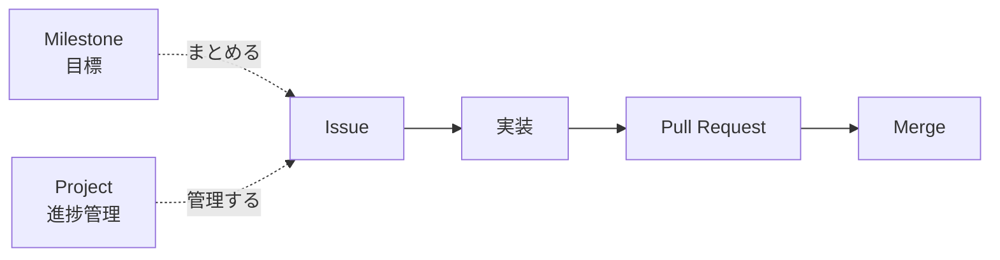

# GitHub Overview

```mermaid
flowchart LR
    M[Milestone<br/>目標]
    P[Project<br/>進捗管理]

    I[Issue]
    D[実装]
    PR[Pull Request]
    MG[Merge]

    M -.まとめる.-> I
    P -.管理する.-> I

    I --> D
    D --> PR
    PR --> MG
```

- Milestone = 開発フェーズの達成率（「認証フェーズ80%完了」など）
- Project = タスク管理表のステータス列（未着手・対応中・レビュー中・完了）
- Issue = 個々のタスクや課題
- Pull Request：実装した内容をレビューしてもらう